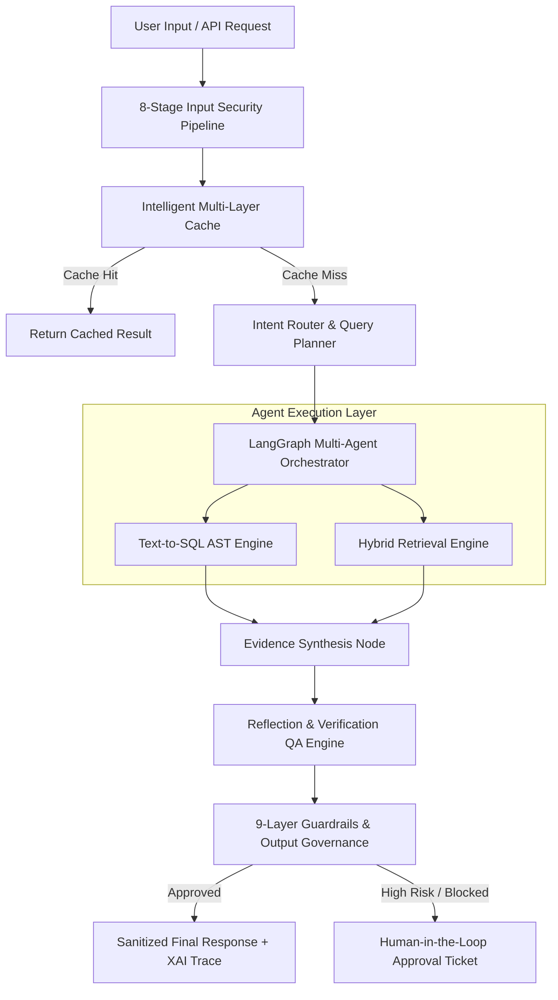

# RAGTUNE - Comprehensive Architectural & Learning Guide

Welcome to the definitive guide for **RAGTUNE**, a domain-agnostic Enterprise Knowledge Intelligence Platform designed for secure, deterministic, and evidence-backed query execution across structured SQL databases and unstructured document repositories.

This document provides:
1. **Executive Architecture & Concept Overview**
2. **Deep-Dive Section-by-Section Module Breakdown**
3. **End-to-End Query Execution Lifecycle**
4. **Step-by-Step Learning Guide & Developer Roadmap**

---

## 1. System Overview & Core Concept

RAGTUNE bridges the gap between raw enterprise data (structured relational databases and unstructured text documents) and AI-driven decision making. Unlike standard conversational AI wrappers, RAGTUNE is engineered as a **zero-trust, deterministic, state-driven multi-agent platform**.



### Key Engineering Pillars
1. **Zero-Trust Input & Output Governance**: Sanitize and inspect all input prompts before LLM execution, and redact/moderate output responses before returning them to clients.
2. **Deterministic SQL Generation**: Use AST (Abstract Syntax Tree) parsing to guarantee syntactically valid, read-only SQL queries.
3. **Hybrid Retrieval with Reciprocal Rank Fusion (RRF)**: Combine BM25 lexical keyword matching with dense vector similarity search, re-ranked via Cross-Encoders.
4. **Reflection & Verification (Self-RAG / CRAG)**: Verify generated answers against raw evidence to eliminate hallucinations and compute groundedness confidence scores.
5. **Multi-Agent LangGraph State Machine**: Orchestrate state transition deterministically across specialized nodes.
6. **Production Cloud Native Deployment**: Ready with Kubernetes HPA (3–100 replicas), Istio service mesh, Terraform IaC, and GitHub Actions CI/CD.

---

## 2. Detailed Section-Wise Working

### Section 1: 8-Stage Input Security Pipeline (`input_security/`)
- **Location**: [`input_security/`](file:///c:/Users/Thinkpad/Desktop/top-tier-projects/ragtune/input_security)
- **Primary Modules**: [`middleware.py`](file:///c:/Users/Thinkpad/Desktop/top-tier-projects/ragtune/input_security/middleware.py), [`framework/`](file:///c:/Users/Thinkpad/Desktop/top-tier-projects/ragtune/input_security/framework), [`stages/`](file:///c:/Users/Thinkpad/Desktop/top-tier-projects/ragtune/input_security/stages)
- **How It Works**:
  Every incoming request must pass sequentially through an 8-stage defense-in-depth security barrier before touching any AI model or data store:
  1. **Unicode NFKC Normalization**: Strips homoglyph attacks, invisible characters, and character-encoding tricks.
  2. **Length & Structure Sanitization**: Enforces maximum input payload constraints.
  3. **Regex Threat Classifier**: Flags known malicious prompt injection patterns.
  4. **SQL & Code Injection Detector**: Blocks payloads attempting `DROP`, `DELETE`, `UNION SELECT`, or system execution.
  5. **Jailbreak & Prompt Injection Guard**: Detects roleplay exploits ("Ignore previous instructions").
  6. **Context Overflow Guard**: Protects context memory boundaries.
  7. **PII Data Anonymization**: Masks emails, SSNs, credit cards, and phone numbers in input prompts.
  8. **Rate Limiting & Abuse Detector**: Restricts high-frequency abuse per IP/Tenant.

---

### Section 2: Intelligent Multi-Layer Cache System (`cache/`)
- **Location**: [`cache/`](file:///c:/Users/Thinkpad/Desktop/top-tier-projects/ragtune/cache)
- **Primary Modules**: [`manager.py`](file:///c:/Users/Thinkpad/Desktop/top-tier-projects/ragtune/cache/manager.py), [`redis_client.py`](file:///c:/Users/Thinkpad/Desktop/top-tier-projects/ragtune/cache/redis_client.py), [`core/`](file:///c:/Users/Thinkpad/Desktop/top-tier-projects/ragtune/cache/core), [`engines/`](file:///c:/Users/Thinkpad/Desktop/top-tier-projects/ragtune/cache/engines)
- **How It Works**:
  - **L1 Exact Match Cache**: Ultra-fast in-memory LRU cache matching identical query strings.
  - **L2 Cosine Semantic Vector Cache**: Vector similarity cache matching incoming queries against past embeddings using cosine similarity. If similarity $> 0.92$, cached answer is returned immediately.
  - **Single-Flight Coalescing Lock**: Prevents "cache stampede" when hundreds of identical queries arrive simultaneously; only one query executes while others wait for the result.

---

### Section 3: Intent Router & Dynamic Query Planner (`router/`)
- **Location**: [`router/`](file:///c:/Users/Thinkpad/Desktop/top-tier-projects/ragtune/router)
- **Primary Modules**: [`classifier.py`](file:///c:/Users/Thinkpad/Desktop/top-tier-projects/ragtune/router/classifier.py), [`planner.py`](file:///c:/Users/Thinkpad/Desktop/top-tier-projects/ragtune/router/planner.py), [`registry.py`](file:///c:/Users/Thinkpad/Desktop/top-tier-projects/ragtune/router/registry.py), [`decision.py`](file:///c:/Users/Thinkpad/Desktop/top-tier-projects/ragtune/router/decision.py)
- **How It Works**:
  Analyzes user queries to determine the optimal execution route:
  - `STRUCTURED_SQL`: Queries asking for quantitative data, aggregates, revenue, counts, or table records.
  - `UNSTRUCTURED_RAG`: Queries asking for policy definitions, SLAs, documentation, or explanatory text.
  - `HYBRID_FUSION`: Queries requiring both relational data and document context.
  - `AMBIGUOUS`: Queries needing clarification or fallback execution.

---

### Section 4: LangGraph Multi-Agent Orchestration Engine (`agents/`, `orchestration/`)
- **Location**: [`agents/`](file:///c:/Users/Thinkpad/Desktop/top-tier-projects/ragtune/agents)
- **Primary Modules**: [`state.py`](file:///c:/Users/Thinkpad/Desktop/top-tier-projects/ragtune/agents/state.py), [`nodes.py`](file:///c:/Users/Thinkpad/Desktop/top-tier-projects/ragtune/agents/nodes.py), [`graph.py`](file:///c:/Users/Thinkpad/Desktop/top-tier-projects/ragtune/agents/graph.py)
- **How It Works**:
  - `AgentState`: Pydantic object encapsulating `user_query`, `intent_route`, `sql_rows`, `retrieved_chunks`, `pre/post_guardrail_results`, `xai_trace`, and execution timing.
  - `AgentOrchestrator`: Assembles execution nodes in sequence:
    1. `pre_guardrail_node`: Runs input guardrails.
    2. `intent_router_node`: Classifies query intent.
    3. `sql_agent_node` / `rag_agent_node`: Executes structured or unstructured retrieval.
    4. `evidence_synthesis_node`: Combines SQL results and retrieved text into a structured response.
    5. `post_guardrail_node`: Evaluates groundedness, checks for PII, and applies output policies.

---

### Section 5: Enterprise Text-to-SQL Engine (`text2sql/`)
- **Location**: [`text2sql/`](file:///c:/Users/Thinkpad/Desktop/top-tier-projects/ragtune/text2sql)
- **Primary Modules**: [`engine.py`](file:///c:/Users/Thinkpad/Desktop/top-tier-projects/ragtune/text2sql/engine.py), [`generator.py`](file:///c:/Users/Thinkpad/Desktop/top-tier-projects/ragtune/text2sql/generator.py), [`validator.py`](file:///c:/Users/Thinkpad/Desktop/top-tier-projects/ragtune/text2sql/validator.py), [`execution.py`](file:///c:/Users/Thinkpad/Desktop/top-tier-projects/ragtune/text2sql/execution.py), [`schema.py`](file:///c:/Users/Thinkpad/Desktop/top-tier-projects/ragtune/text2sql/schema.py)
- **How It Works**:
  - **Schema Introspector**: Inspects table schemas, column data types, foreign keys, and primary keys.
  - **AST SQL Generator & Validator (`sqlglot`)**: Parses generated SQL into Abstract Syntax Trees.
  - **Strict Read-Only Enforcement**: Rejects any non-`SELECT` statement (`INSERT`, `UPDATE`, `DELETE`, `DROP`, `ALTER`, `GRANT`, `EXEC`) at the AST node level before execution.
  - **SQLExecutionEngine**: Safely executes read-only queries against PostgreSQL/SQLite databases.

---

### Section 6: Enterprise Hybrid Retrieval Engine (`retrieval/`)
- **Location**: [`retrieval/`](file:///c:/Users/Thinkpad/Desktop/top-tier-projects/ragtune/retrieval)
- **Primary Modules**: [`engine.py`](file:///c:/Users/Thinkpad/Desktop/top-tier-projects/ragtune/retrieval/engine.py), [`hybrid_search.py`](file:///c:/Users/Thinkpad/Desktop/top-tier-projects/ragtune/retrieval/hybrid_search.py), [`fusion.py`](file:///c:/Users/Thinkpad/Desktop/top-tier-projects/ragtune/retrieval/fusion.py), [`reranker.py`](file:///c:/Users/Thinkpad/Desktop/top-tier-projects/ragtune/retrieval/reranker.py), [`search.py`](file:///c:/Users/Thinkpad/Desktop/top-tier-projects/ragtune/retrieval/search.py)
- **How It Works**:
  1. **Dense Vector Search**: Embeds query and retrieves top-$k$ nearest neighbors via vector distance.
  2. **Sparse Lexical Search (BM25)**: Evaluates exact keyword frequency and inverse document frequency.
  3. **Reciprocal Rank Fusion (RRF)**: Merges sparse and dense search rankings using the RRF formula:
     $$\text{RRF Score}(d) = \sum_{m \in M} \frac{1}{k + r_m(d)}$$
     where $k=60$.
  4. **Cross-Encoder Re-Ranker**: Scores query-document pairs with a cross-encoder model to return top relevant context chunks.

---

### Section 7: Reflection & Verification QA Engine (`verification/`)
- **Location**: [`verification/`](file:///c:/Users/Thinkpad/Desktop/top-tier-projects/ragtune/verification)
- **Primary Modules**: [`engine.py`](file:///c:/Users/Thinkpad/Desktop/top-tier-projects/ragtune/verification/engine.py), [`self_rag.py`](file:///c:/Users/Thinkpad/Desktop/top-tier-projects/ragtune/verification/self_rag.py), [`crag.py`](file:///c:/Users/Thinkpad/Desktop/top-tier-projects/ragtune/verification/crag.py), [`grounding.py`](file:///c:/Users/Thinkpad/Desktop/top-tier-projects/ragtune/verification/grounding.py), [`hallucination.py`](file:///c:/Users/Thinkpad/Desktop/top-tier-projects/ragtune/verification/hallucination.py), [`decision.py`](file:///c:/Users/Thinkpad/Desktop/top-tier-projects/ragtune/verification/decision.py)
- **How It Works**:
  - **Self-RAG Reflection Subsystem**: Evaluates if retrieved documents are relevant and if generated responses answer the query.
  - **Corrective RAG (CRAG) Evaluator**: Assigns confidence scores to retrieval quality; triggers fallback web search or query rewriting if confidence is low.
  - **Groundedness Verifier & Hallucination Detector**: Verifies claims against underlying evidence. If groundedness score $< 0.70$, response is flagged or rewritten.

---

### Section 8: Output Security & Response Governance Engine (`output_governance/`)
- **Location**: [`output_governance/`](file:///c:/Users/Thinkpad/Desktop/top-tier-projects/ragtune/output_governance)
- **Primary Modules**: [`engine.py`](file:///c:/Users/Thinkpad/Desktop/top-tier-projects/ragtune/output_governance/engine.py), [`redaction.py`](file:///c:/Users/Thinkpad/Desktop/top-tier-projects/ragtune/output_governance/redaction.py), [`moderation.py`](file:///c:/Users/Thinkpad/Desktop/top-tier-projects/ragtune/output_governance/moderation.py), [`policy.py`](file:///c:/Users/Thinkpad/Desktop/top-tier-projects/ragtune/output_governance/policy.py), [`validation.py`](file:///c:/Users/Thinkpad/Desktop/top-tier-projects/ragtune/output_governance/validation.py)
- **How It Works**:
  - **Response Schema Validation**: Ensures output follows standard structural schemas.
  - **Content Moderation Engine**: Filters hate speech, toxic content, or unauthorized medical/legal advice.
  - **Zero-Trust Sensitive Data Redactor**: Redacts PII, API tokens, passwords, credit card numbers, and internal IP addresses before delivery to client.
  - **Policy Engine**: Enforces compliance rules (e.g., SLA compliance disclosures).

---

### Section 9: 9-Layer Enterprise Guardrails Pipeline (`guardrails/`)
- **Location**: [`guardrails/`](file:///c:/Users/Thinkpad/Desktop/top-tier-projects/ragtune/guardrails)
- **Primary Modules**: [`pipeline.py`](file:///c:/Users/Thinkpad/Desktop/top-tier-projects/ragtune/guardrails/pipeline.py), [`layers/`](file:///c:/Users/Thinkpad/Desktop/top-tier-projects/ragtune/guardrails/layers)
- **How It Works**:
  Runs pre-execution and post-execution checks across 9 dedicated security & governance layers (Prompt Safety, Role-Based Access Control, Schema Governance, Groundedness Verification, PII Redaction, System Harm Mitigation, Compliance Policy, Output Moderation, HITL Escalation).

---

### Section 10: Explainable AI (XAI) & Tracing (`xai/`)
- **Location**: [`xai/`](file:///c:/Users/Thinkpad/Desktop/top-tier-projects/ragtune/xai)
- **Primary Modules**: [`tracer.py`](file:///c:/Users/Thinkpad/Desktop/top-tier-projects/ragtune/xai/tracer.py)
- **How It Works**:
  Tracks full lineage of query processing (inputs, intent classification score, SQL AST generation, raw DB rows, retrieved document chunk IDs, groundedness scores, redaction events, and timing per stage).

---

### Section 11: Human-in-the-Loop (HITL) Workflow (`hitl/`)
- **Location**: [`hitl/`](file:///c:/Users/Thinkpad/Desktop/top-tier-projects/ragtune/hitl)
- **Primary Modules**: [`manager.py`](file:///c:/Users/Thinkpad/Desktop/top-tier-projects/ragtune/hitl/manager.py)
- **How It Works**:
  When a query violates critical safety policies, has low groundedness, or attempts a sensitive data operation, HITL creates an approval ticket with high-risk flags, holding execution until a human admin approves or rejects the action.

---

### Section 12: Enterprise Security, IAM & Multi-Tenancy (`auth/`, `security/`)
- **Location**: [`auth/`](file:///c:/Users/Thinkpad/Desktop/top-tier-projects/ragtune/auth), [`security/`](file:///c:/Users/Thinkpad/Desktop/top-tier-projects/ragtune/security)
- **Primary Modules**: [`auth/api/`](file:///c:/Users/Thinkpad/Desktop/top-tier-projects/ragtune/auth/api), [`auth/domain/`](file:///c:/Users/Thinkpad/Desktop/top-tier-projects/ragtune/auth/domain), [`auth/services/`](file:///c:/Users/Thinkpad/Desktop/top-tier-projects/ragtune/auth/services), [`security/rbac.py`](file:///c:/Users/Thinkpad/Desktop/top-tier-projects/ragtune/security/rbac.py)
- **How It Works**:
  - Role-Based Access Control (RBAC): Admin, Analyst, Viewer roles with fine-grained permission attributes.
  - JWT Authentication & OAuth Token Rotation: Secure stateless API authentication.
  - Multi-Tenancy Isolation: Filters database rows and vector store collections by tenant ID.

---

### Section 13: Data Ingestion & Storage (`storage/`, `demo_data/`)
- **Location**: [`storage/`](file:///c:/Users/Thinkpad/Desktop/top-tier-projects/ragtune/storage), [`demo_data/`](file:///c:/Users/Thinkpad/Desktop/top-tier-projects/ragtune/demo_data)
- **Primary Modules**: [`db_connector.py`](file:///c:/Users/Thinkpad/Desktop/top-tier-projects/ragtune/storage/db_connector.py), [`document_processor.py`](file:///c:/Users/Thinkpad/Desktop/top-tier-projects/ragtune/storage/document_processor.py), [`vector_store.py`](file:///c:/Users/Thinkpad/Desktop/top-tier-projects/ragtune/storage/vector_store.py)
- **How It Works**:
  - `document_processor.py`: Reads enterprise PDFs, Markdown, and TXT docs, splitting them into overlapping chunks with metadata.
  - `vector_store.py`: Embeds chunks using sentence transformers and stores vectors in ChromaDB / FAISS.
  - `db_connector.py`: Manages SQLAlchemy connection pools to SQLite / Aurora PostgreSQL.

---

### Section 14: REST API Gateway & Web Interface (`api/`, `frontend/`, `main.py`)
- **Location**: [`api/`](file:///c:/Users/Thinkpad/Desktop/top-tier-projects/ragtune/api), [`frontend/`](file:///c:/Users/Thinkpad/Desktop/top-tier-projects/ragtune/frontend), [`main.py`](file:///c:/Users/Thinkpad/Desktop/top-tier-projects/ragtune/main.py)
- **Primary Modules**: [`api/main.py`](file:///c:/Users/Thinkpad/Desktop/top-tier-projects/ragtune/api/main.py), [`api/schemas.py`](file:///c:/Users/Thinkpad/Desktop/top-tier-projects/ragtune/api/schemas.py), [`frontend/index.html`](file:///c:/Users/Thinkpad/Desktop/top-tier-projects/ragtune/frontend/index.html)
- **How It Works**:
  - `FastAPI`: Serves endpoints `/api/v1/query`, `/api/v1/health`, `/api/v1/stats`, `/api/v1/hitl/tickets`.
  - Web UI: Responsive glassmorphism dashboard built with HTML5, CSS3, and JavaScript for executing queries, visualizing XAI traces, and managing HITL tickets.

---

### Section 15: Cloud Infrastructure & Deployment Topology (`infrastructure/`, `k8s/`, `.github/`)
- **Location**: [`infrastructure/`](file:///c:/Users/Thinkpad/Desktop/top-tier-projects/ragtune/infrastructure), [`k8s/`](file:///c:/Users/Thinkpad/Desktop/top-tier-projects/ragtune/k8s), [`.github/`](file:///c:/Users/Thinkpad/Desktop/top-tier-projects/ragtune/.github)
- **How It Works**:
  - **Terraform IaC**: Provisions EKS Kubernetes clusters, Aurora PostgreSQL, ElastiCache Redis, and Vault secrets.
  - **Kubernetes Topology**:
    - `deployment.yaml`: Non-root containers, anti-affinity, readiness probes.
    - `hpa.yaml`: Horizontal Pod Autoscaler scaling from 3 to 100 pods based on CPU/RAM targets.
    - `network-policy.yaml`: Zero-trust network segmentation.
    - `ingress.yaml`: TLS termination via cert-manager.
  - **GitHub Actions CI/CD**: Runs unit tests, builds container images, scans vulnerabilities with Trivy, and performs rolling updates.

---

## 3. End-to-End Query Execution Lifecycle

When a user submits a query (e.g., *"What is our SLA uptime for Acme Corp and total revenue generated in Q3?"*):

```
1. Client POST request /api/v1/query
   │
2. [Input Security Pipeline] ── Sanitizes unicode, validates length, checks for SQL injection & prompt jailbreaks.
   │
3. [Cache Manager] ────────── Checks L1 exact match & L2 semantic vector similarity.
   │                           (If match found, return cached response)
   │
4. [Intent Router] ────────── Classifies query as HYBRID_FUSION (needs SQL data + doc RAG).
   │
5. [LangGraph Orchestrator] ─ Starts execution workflow with initial AgentState.
   ├──> [SQL Agent] ────────── Schema introspection -> AST generation -> AST read-only validation -> Executes SQL query -> Fetches 5 revenue rows.
   ├──> [RAG Agent] ────────── Dense + BM25 search -> RRF fusion ($k=60$) -> Cross-encoder rerank -> Retrieves top 3 SLA context chunks.
   │
6. [Evidence Synthesis] ───── Merges SQL tabular results + document text chunks into synthesized response draft.
   │
7. [Verification Engine] ──── Runs Self-RAG reflection & groundedness calculation (Groundedness = 0.96).
   │
8. [Output Governance] ───── Scans response for PII/secrets, applies redaction, and verifies compliance policy.
   │
9. [XAI Tracer] ──────────── Attaches transparent trace log (execution time, SQL queries, chunk IDs, confidence).
   │
10. Final Response returned to user UI / API client.
```

---

## 4. How to Learn Each Component (Developer Roadmap)

To master this codebase and understand how to build enterprise-grade Knowledge Intelligence platforms, follow this structured learning path:

### Step 1: Core Foundation & Data Models
- **Concepts to Learn**: Pydantic models, Python type annotations, dataclasses.
- **Files to Read**:
  1. [`agents/state.py`](file:///c:/Users/Thinkpad/Desktop/top-tier-projects/ragtune/agents/state.py)
  2. [`api/schemas.py`](file:///c:/Users/Thinkpad/Desktop/top-tier-projects/ragtune/api/schemas.py)
  3. [`config/settings.py`](file:///c:/Users/Thinkpad/Desktop/top-tier-projects/ragtune/config/settings.py)
- **Hands-on Task**: Add a custom metadata field (e.g., `user_department`) to `AgentState` and propagate it through `UserContext`.

---

### Step 2: Input Security & Threat Defense
- **Concepts to Learn**: Unicode normalization (NFKC), Regular Expressions for threat detection, OWASP LLM Top 10 security risks (Prompt Injection, Insecure Output Handling).
- **Files to Read**:
  1. [`input_security/middleware.py`](file:///c:/Users/Thinkpad/Desktop/top-tier-projects/ragtune/input_security/middleware.py)
  2. [`input_security/stages/`](file:///c:/Users/Thinkpad/Desktop/top-tier-projects/ragtune/input_security/stages)
- **Hands-on Task**: Write a test case in `tests/` attempting a custom prompt injection and verify the 8-stage pipeline blocks it.

---

### Step 3: Intent Routing & Decision Engines
- **Concepts to Learn**: Pattern matching vs. ML intent classification, dynamic capability registries, strategy pattern.
- **Files to Read**:
  1. [`router/classifier.py`](file:///c:/Users/Thinkpad/Desktop/top-tier-projects/ragtune/router/classifier.py)
  2. [`router/planner.py`](file:///c:/Users/Thinkpad/Desktop/top-tier-projects/ragtune/router/planner.py)
  3. [`router/registry.py`](file:///c:/Users/Thinkpad/Desktop/top-tier-projects/ragtune/router/registry.py)
- **Hands-on Task**: Add a new intent route (e.g. `TIME_SERIES_FORECAST`) to `router/classifier.py`.

---

### Step 4: Text-to-SQL Engine & AST Parsing
- **Concepts to Learn**: SQL Abstract Syntax Trees (AST), `sqlglot` library, schema introspection, database security & read-only enforcement.
- **Files to Read**:
  1. [`text2sql/schema.py`](file:///c:/Users/Thinkpad/Desktop/top-tier-projects/ragtune/text2sql/schema.py)
  2. [`text2sql/generator.py`](file:///c:/Users/Thinkpad/Desktop/top-tier-projects/ragtune/text2sql/generator.py)
  3. [`text2sql/validator.py`](file:///c:/Users/Thinkpad/Desktop/top-tier-projects/ragtune/text2sql/validator.py)
  4. [`text2sql/engine.py`](file:///c:/Users/Thinkpad/Desktop/top-tier-projects/ragtune/text2sql/engine.py)
- **Hands-on Task**: Try passing a query containing `DROP TABLE` or `UPDATE` to `validator.py` and inspect how `sqlglot` AST traversal catches and blocks it.

---

### Step 5: Enterprise Hybrid Retrieval & Re-ranking
- **Concepts to Learn**: Dense vector search (embeddings, cosine similarity), BM25 lexical search, Reciprocal Rank Fusion (RRF), Cross-Encoder re-ranking models.
- **Files to Read**:
  1. [`retrieval/search.py`](file:///c:/Users/Thinkpad/Desktop/top-tier-projects/ragtune/retrieval/search.py)
  2. [`retrieval/fusion.py`](file:///c:/Users/Thinkpad/Desktop/top-tier-projects/ragtune/retrieval/fusion.py)
  3. [`retrieval/reranker.py`](file:///c:/Users/Thinkpad/Desktop/top-tier-projects/ragtune/retrieval/reranker.py)
  4. [`retrieval/engine.py`](file:///c:/Users/Thinkpad/Desktop/top-tier-projects/ragtune/retrieval/engine.py)
- **Hands-on Task**: Adjust constant $k$ in RRF formula inside `fusion.py` from 60 to 30 and observe changes in chunk rankings.

---

### Step 6: Multi-Agent Orchestration with LangGraph
- **Concepts to Learn**: State machine workflows, DAG (Directed Acyclic Graphs), state transitions, conditional edges.
- **Files to Read**:
  1. [`agents/nodes.py`](file:///c:/Users/Thinkpad/Desktop/top-tier-projects/ragtune/agents/nodes.py)
  2. [`agents/graph.py`](file:///c:/Users/Thinkpad/Desktop/top-tier-projects/ragtune/agents/graph.py)
- **Hands-on Task**: Add a new agent node (e.g. `summarizer_agent_node`) into `agents/nodes.py` and integrate it into `AgentOrchestrator.execute_workflow`.

---

### Step 7: Reflection, Groundedness & Self-RAG
- **Concepts to Learn**: Self-RAG reflection tokens, Corrective RAG (CRAG), hallucination detection algorithms, groundedness score calculation.
- **Files to Read**:
  1. [`verification/self_rag.py`](file:///c:/Users/Thinkpad/Desktop/top-tier-projects/ragtune/verification/self_rag.py)
  2. [`verification/crag.py`](file:///c:/Users/Thinkpad/Desktop/top-tier-projects/ragtune/verification/crag.py)
  3. [`verification/grounding.py`](file:///c:/Users/Thinkpad/Desktop/top-tier-projects/ragtune/verification/grounding.py)
  4. [`verification/engine.py`](file:///c:/Users/Thinkpad/Desktop/top-tier-projects/ragtune/verification/engine.py)
- **Hands-on Task**: Test how the verification engine behaves when provided contradictory evidence.

---

### Step 8: Output Governance & Zero-Trust Redaction
- **Concepts to Learn**: PII detection patterns (regex + NER), sensitive token masking, content moderation, compliance policies.
- **Files to Read**:
  1. [`output_governance/redaction.py`](file:///c:/Users/Thinkpad/Desktop/top-tier-projects/ragtune/output_governance/redaction.py)
  2. [`output_governance/moderation.py`](file:///c:/Users/Thinkpad/Desktop/top-tier-projects/ragtune/output_governance/moderation.py)
  3. [`output_governance/policy.py`](file:///c:/Users/Thinkpad/Desktop/top-tier-projects/ragtune/output_governance/policy.py)
  4. [`output_governance/engine.py`](file:///c:/Users/Thinkpad/Desktop/top-tier-projects/ragtune/output_governance/engine.py)
- **Hands-on Task**: Add a new regex mask for masking AWS Secret Access Keys in `redaction.py`.

---

### Step 9: Multi-Tier Caching & Performance
- **Concepts to Learn**: In-memory LRU caching, Cosine distance in vector space, Single-flight lock pattern, cache hit telemetry.
- **Files to Read**:
  1. [`cache/manager.py`](file:///c:/Users/Thinkpad/Desktop/top-tier-projects/ragtune/cache/manager.py)
  2. [`cache/redis_client.py`](file:///c:/Users/Thinkpad/Desktop/top-tier-projects/ragtune/cache/redis_client.py)
- **Hands-on Task**: Run benchmarking tests using `pytest tests/test_cache.py` to compare exact hit latency vs semantic hit latency.

---

### Step 10: Infrastructure, Cloud & DevOps
- **Concepts to Learn**: Terraform IaC, Docker multi-stage builds, Kubernetes manifests (Deployment, Service, Ingress, HPA, NetworkPolicy), GitHub Actions CI/CD workflows.
- **Files to Read**:
  1. [`Dockerfile`](file:///c:/Users/Thinkpad/Desktop/top-tier-projects/ragtune/Dockerfile)
  2. [`infrastructure/terraform/main.tf`](file:///c:/Users/Thinkpad/Desktop/top-tier-projects/ragtune/infrastructure/terraform/main.tf)
  3. [`k8s/deployment.yaml`](file:///c:/Users/Thinkpad/Desktop/top-tier-projects/ragtune/k8s/deployment.yaml)
  4. [`k8s/hpa.yaml`](file:///c:/Users/Thinkpad/Desktop/top-tier-projects/ragtune/k8s/hpa.yaml)
  5. [`.github/workflows/deploy.yml`](file:///c:/Users/Thinkpad/Desktop/top-tier-projects/ragtune/.github/workflows/deploy.yml)
- **Hands-on Task**: Inspect the HPA scaling triggers in `k8s/hpa.yaml` and security context in `k8s/deployment.yaml`.

---

## 5. Verification & Testing

To verify your environment and validate that all modules are working as expected, execute the automated test suite:

```bash
# Install dependencies
pip install -r requirements.txt

# Seed demo database & document vector store
python main.py --seed

# Run complete pytest test suite
python -m pytest tests/ -v
```

All tests should pass clean across input security, caching, router, text2sql AST parsing, hybrid retrieval, agent orchestration, verification, output governance, RBAC, and REST API routes.

---
*Happy coding and building enterprise knowledge intelligence platforms with RAGTUNE!*
