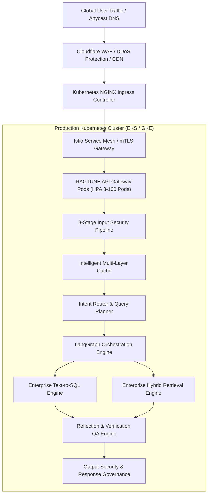

# RAGTUNE - Enterprise Knowledge Intelligence Platform


RAGTUNE is a domain-agnostic Enterprise Knowledge Intelligence Platform engineered for organizations to query, reason, and execute evidence-backed decisions across structured SQL databases and unstructured enterprise documents.

Unlike simple conversational chatbots, RAGTUNE is a deterministic, cloud-native, secure, and transparent intelligence platform combining Cloud-Native Kubernetes Infrastructure, an Output Security & Response Governance Engine, a Reflection & Verification Engine (Self-RAG & CRAG), an Enterprise Text-to-SQL Engine, a Production-Grade Hybrid Retrieval Engine, an Intent Router, multi-agent orchestration, an 8-stage Input Security Pipeline, an Intelligent Multi-Layer Caching System, a 9-layer Guardrails system, Explainable AI (XAI) execution tracing, and Human-in-the-Loop (HITL) approval workflows.


---

## Table of Contents
- [Platform Architecture](#platform-architecture)
- [Production Cloud Infrastructure](#production-cloud-infrastructure)
- [Kubernetes & Deployment Topology](#kubernetes--deployment-topology)
- [CI/CD Automation Pipeline](#cicd-automation-pipeline)
- [Output Security & Response Governance Engine](#output-security--response-governance-engine)
- [Reflection, Verification & Quality Assurance Engine](#reflection-verification--quality-assurance-engine)
- [Enterprise Text-to-SQL Engine](#enterprise-text-to-sql-engine)
- [Enterprise Hybrid Retrieval Engine](#enterprise-hybrid-retrieval-engine)
- [Intent Router & Query Planning Engine](#intent-router--query-planning-engine)
- [Workflow Orchestration Engine](#workflow-orchestration-engine)
- [Intelligent Caching System](#intelligent-caching-system)
- [Input Security Pipeline](#input-security-pipeline)
- [Enterprise IAM & Multi-Tenancy](#enterprise-iam--multi-tenancy)
- [9-Layer Enterprise Guardrails Pipeline](#9-layer-enterprise-guardrails-pipeline)
- [Core Technology Stack](#core-technology-stack)
- [Quick Start Guide](#quick-start-guide)
- [REST API Documentation](#rest-api-documentation)
- [License](#license)

---

## Platform Architecture

RAGTUNE is built around an event-driven multi-agent state machine powered by LangGraph. All incoming user requests pass through an Input Security Pipeline, an Intelligent Cache, an Intent Router, Execution Engines, a Verification Engine, and an Output Security & Response Governance Engine.




---

## Production Cloud Infrastructure

RAGTUNE is provisioned via Infrastructure-as-Code (`infrastructure/terraform/main.tf`):
- **Cloud Provider**: AWS / GCP / Azure Multi-Cloud capability.
- **Compute Cluster**: AWS EKS Kubernetes cluster with automated node scaling.
- **Database Layer**: AWS Aurora PostgreSQL Multi-AZ cluster with encrypted storage.
- **Cache Cluster**: AWS ElastiCache Redis Enterprise cluster for L1/L2 caching.
- **Secrets Management**: HashiCorp Vault / AWS Secrets Manager integration.

---

## Kubernetes & Deployment Topology

Production Kubernetes manifests (`k8s/`):
- `deployment.yaml`: Replicas=3, rolling update strategy, non-root security context (`UID 10001`), pod anti-affinity, and liveness/readiness health probes.
- `hpa.yaml`: HorizontalPodAutoscaler scaling dynamically between 3 and 100 replicas based on 70% CPU and 80% Memory targets.
- `service.yaml`: ClusterIP service for internal load balancing.
- `ingress.yaml`: NGINX Ingress with cert-manager Let's Encrypt TLS termination and rate-limiting annotations.
- `network-policy.yaml`: Zero-Trust NetworkPolicy restricting pod ingress/egress boundaries.

---

## CI/CD Automation Pipeline

Continuous Delivery is automated via GitHub Actions (`.github/workflows/deploy.yml`):
1. **Automated Testing**: Runs pytest test suite across Python 3.11.
2. **Container Security & Build**: Builds multi-stage Docker image and executes Trivy vulnerability scanning.
3. **Registry Push**: Publishes tagged images to GitHub Container Registry (`ghcr.io/sreeram0343/ragtune`).
4. **Kubernetes Rollout**: Deploys manifests to EKS cluster and validates zero-downtime rolling update status.

---

## Core Technology Stack

- **Cloud & Container Infrastructure**: Docker Multi-Stage, Kubernetes EKS, Terraform IaC, Helm, NGINX Ingress Controller, cert-manager
- **CI/CD & DevOps**: GitHub Actions, GitHub Container Registry (GHCR), Trivy
- **Observability Stack**: Prometheus, Grafana, AlertManager, OpenTelemetry, Jaeger
- **Backend Gateway**: FastAPI, Pydantic v2, Uvicorn
- **Output Security & Governance Engine**: Response Schema Validator, Content Moderator, Sensitive Data Redactor, Policy Engine
- **Reflection & Verification Engine**: Self-RAG Reflection Subsystem, CRAG Evaluator, Groundedness Verifier, Hallucination Detector
- **Enterprise Text-to-SQL Engine**: AST Parser (`sqlglot`), Schema Introspector, Read-Only SQLExecutionEngine
- **Hybrid Retrieval Engine**: Dense Vector Search, BM25 Lexical Sparse Search, RRF Fusion ($k=60$), Cross-Encoder Re-Ranker
- **Intent Router & Planner**: Dynamic Capability Registry, Pattern Intent Classifier, Strategy Decision Engine
- **Orchestration Engine**: LangGraph StateGraph Framework, State Checkpointer
- **Intelligent Caching System**: L1 Exact Match LRU Cache, L2 Cosine Semantic Vector Cache, Single-Flight Coalescing Lock
- **Input Security Pipeline**: 8-Stage Defense-in-Depth Framework, Unicode NFKC, Regex Threat Classifiers
- **Database Persistence**: SQLAlchemy 2.0, SQLite / PostgreSQL
- **Frontend Dashboard**: HTML5, Vanilla CSS Glassmorphism, Modern SPA Architecture

---

## Quick Start Guide

### 1. Installation
Clone the repository and install the dependencies:

```bash
git clone https://github.com/sreeram0343/ragtune.git
cd ragtune
pip install -r requirements.txt
```

### 2. Seed Enterprise Demo Data
Generate the pre-seeded SQLite enterprise database and sample knowledge documents:

```bash
python main.py --seed
```

### 3. Launch Web Platform & Gateway Server
Start the platform on `http://localhost:8000`:

```bash
python main.py
```

Access the interactive Web Dashboard in your browser: `http://localhost:8000`

### 4. Run Standalone CLI Query
Execute an intelligence query via the command line interface:

```bash
python main.py --query "What is our uptime commitment for Acme Enterprise under SLA terms?"
```

### 5. Run Automated Test Suite
Execute the full test suite covering Output Governance, Reflection & Verification, Text-to-SQL, Hybrid Retrieval, Intent Router & Planning, LangGraph Workflow Orchestration, Intelligent Cache, Input Security Pipeline, IAM, authentication, token rotation, RBAC, guardrails, agents, and REST APIs:

```bash
python -m pytest tests/ -v
```

---

## Production Cloud Deployment (Vercel & Render)

RAGTUNE is pre-configured for multi-cloud production deployment.

### Frontend Deployment (Vercel)
1. Import this repository in [Vercel](https://vercel.com).
2. Set Root Directory to `./` or `frontend`.
3. Vercel automatically detects `vercel.json` and proxies `/api/*` and `/health` requests to the Render backend service seamlessly.

### Backend Deployment (Render)
1. In [Render](https://render.com), click **New > Blueprint**.
2. Connect your GitHub repository. Render automatically reads `render.yaml` and provisions the Python Web Service.
3. Configure environment variables in Render dashboard (e.g. `CORS_ORIGINS`, `SECRET_KEY`).

---

## License

Released under the [Apache License 2.0](LICENSE). Built for enterprise knowledge intelligence.
