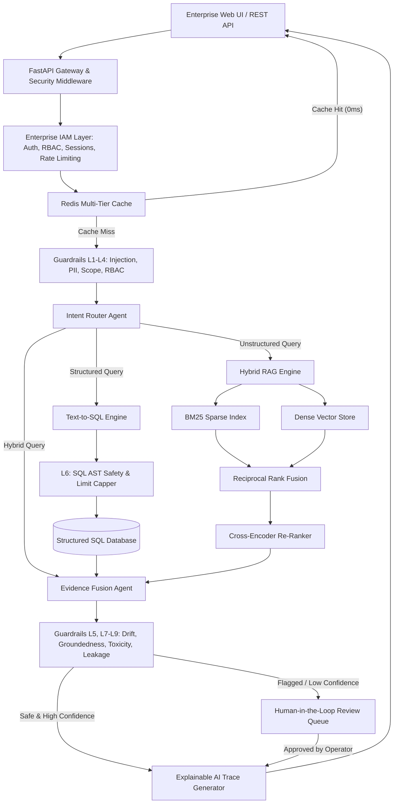

# RAGTUNE - Enterprise Knowledge Intelligence Platform


**RAGTUNE** is an enterprise-grade, domain-agnostic Knowledge Intelligence Platform engineered for organizations to query, reason, and execute evidence-backed decisions across structured SQL databases and unstructured enterprise documents.

This is **NOT** a simple chatbot. It is a deterministic, secure, and transparent Enterprise Intelligence Platform combining:

- **Enterprise Identity & Access Management (IAM)**: Independent, decoupled multi-tenant authentication, organization hierarchy, workspace isolation, Refresh Token Rotation (RTR), brute force defense, and audit logging.
- **Multi-Agent LangGraph Orchestration**: Dynamic routing across specialized reasoning nodes.
- **Text-to-SQL Synthesis**: Schema introspection, SQL AST validation, and automated self-repair.
- **Hybrid Search & Cross-Encoder Re-Ranking**: Dense vector embeddings + BM25 sparse index combined via Reciprocal Rank Fusion (RRF).
- **9-Layer Enterprise Guardrails Pipeline**: Pre/post execution security matrix protecting PII, preventing prompt injection, enforcing read-only SQL, and blocking hallucinations.
- **Explainable AI (XAI)**: Full step-by-step visual execution graphs, timing metrics, and citation attributions.
- **Human-in-the-Loop (HITL)**: Interactive operator review queue for low-confidence or policy-triggered queries.
- **Redis & Multi-Tier Caching**: Semantic vector caching and SQL result caching with TTL.

---

## 📋 Table of Contents
- [Architecture Overview](#-architecture-overview)
- [Enterprise IAM & Security Layer](#-enterprise-iam--security-layer)
- [9-Layer Enterprise Guardrails Pipeline](#-9-layer-enterprise-guardrails-pipeline)
- [Quick Start Guide](#-quick-start-guide)
- [REST API Documentation](#-rest-api-documentation)
- [License](#-license)

---

## 🏛️ Architecture Overview



---

## 🔐 Enterprise IAM & Security Layer

The platform identity architecture provides a production-ready trust boundary:

1. **Multi-Tenant Hierarchy**: Domain isolation supporting `Organization` → `Workspace` → `Project` → `User` membership models.
2. **PBKDF2 Password Hashing**: Cryptographically salted PBKDF2-HMAC-SHA256 password hashing (600,000 rounds).
3. **Refresh Token Rotation (RTR)**: Each refresh request invalidates the previous refresh token and issues a new pair.
4. **Instant Security Revocation**: Changing passwords or administrative account suspension revokes all active sessions across all devices instantly.
5. **Brute Force Lockout**: Velocity rate limiting with 15-minute lockouts after 5 consecutive failed login attempts.
6. **Immutable Audit Logging**: Every registration, login, privilege change, password update, and suspension is recorded in audit logs.

---

## 🛡️ 9-Layer Enterprise Guardrails Pipeline

| Layer | Guardrail Name | Scope | Description |
| :--- | :--- | :--- | :--- |
| **L1** | **Prompt Injection Defense** | Pre-Execution | Scans queries for adversarial payloads, jailbreaks, and system overrides. |
| **L2** | **PII & PHI Anonymization** | Pre-Execution | Detects and dynamically masks Emails, Phone numbers, SSNs, Credit Cards, and IPs. |
| **L3** | **Domain Scope Boundary** | Pre-Execution | Ensures user queries remain strictly within enterprise business domain boundaries. |
| **L4** | **RBAC & Tenant Isolation** | Pre-Execution | Validates user role permissions and restricts multi-tenant table access. |
| **L5** | **Semantic Drift Guard** | Post-Execution | Measures context-query embedding overlap to prevent semantic hallucination drift. |
| **L6** | **SQL AST Safety & Capper** | Pre/Post Execution | Enforces read-only `SELECT` queries, rejects DDL/DML, and caps `LIMIT` bounds. |
| **L7** | **Groundedness & NLI Citation** | Post-Execution | Evaluates sentence-by-sentence factual grounding against source evidence. |
| **L8** | **Toxicity & Harm Filter** | Post-Execution | Scans output content for profane, harmful, or discriminatory terminology. |
| **L9** | **Data Leakage Scanner** | Post-Execution | Prevents leakage of internal credentials, API keys, or system prompt instructions. |

---

## 🚀 Quick Start Guide

### 1. Installation
Ensure Python 3.11+ is installed. Clone the repository and install dependencies:

```bash
git clone https://github.com/sreeram0343/ragtune.git
cd ragtune
pip install -r requirements.txt
```

### 2. Seed Enterprise Demo Data
Generate the sample SQLite enterprise database and document knowledge files:

```bash
python main.py --seed
```

### 3. Launch Web Platform & Gateway Server
Start the platform on `http://localhost:8000`:

```bash
python main.py
```

Access the interactive web dashboard at: `http://localhost:8000`

### 4. Run Automated Test Suite
Run unit and integration tests covering IAM, authentication, token rotation, RBAC, guardrails, Text-to-SQL, hybrid search, agents, and REST API:

```bash
python -m pytest tests/ -v
```

---

## 📡 REST API Documentation

### IAM & Authentication Endpoints
- `POST /api/v1/auth/register`: User registration with password strength validation.
- `POST /api/v1/auth/login`: Authenticates credentials & issues Access + Refresh Tokens.
- `POST /api/v1/auth/refresh`: Refresh Token Rotation (RTR).
- `POST /api/v1/auth/logout`: Revokes active session.
- `POST /api/v1/auth/logout-all`: Revokes all user sessions across all devices.
- `GET /api/v1/auth/me`: Returns profile and active SecurityContext permissions.
- `POST /api/v1/auth/password/change`: Password update with session revocation.
- `POST /api/v1/auth/organizations`: Creates Organization & default Workspace.
- `POST /api/v1/auth/invitations`: Issues Org/Workspace invitation token.
- `POST /api/v1/auth/invitations/accept`: Accepts invitation token.
- `GET /api/v1/auth/audit-logs`: Queries immutable security audit logs.
- `POST /api/v1/auth/admin/users/{user_id}/suspend`: Administrative account suspension.

### Intelligence & System Endpoints
- `POST /api/v1/query`: Submits query to multi-agent reasoning engine.
- `POST /api/v1/ingest/text`: Ingests document snippets into hybrid vector retriever.
- `GET /api/v1/schema`: Returns introspected database tables and column schemas.
- `GET /api/v1/hitl/queue`: Lists pending Human-in-the-Loop review tickets.
- `GET /api/v1/xai/{trace_id}`: Retrieves step-by-step XAI execution graph.

---

## 📄 License
Released under the MIT License. Built for enterprise knowledge intelligence.
