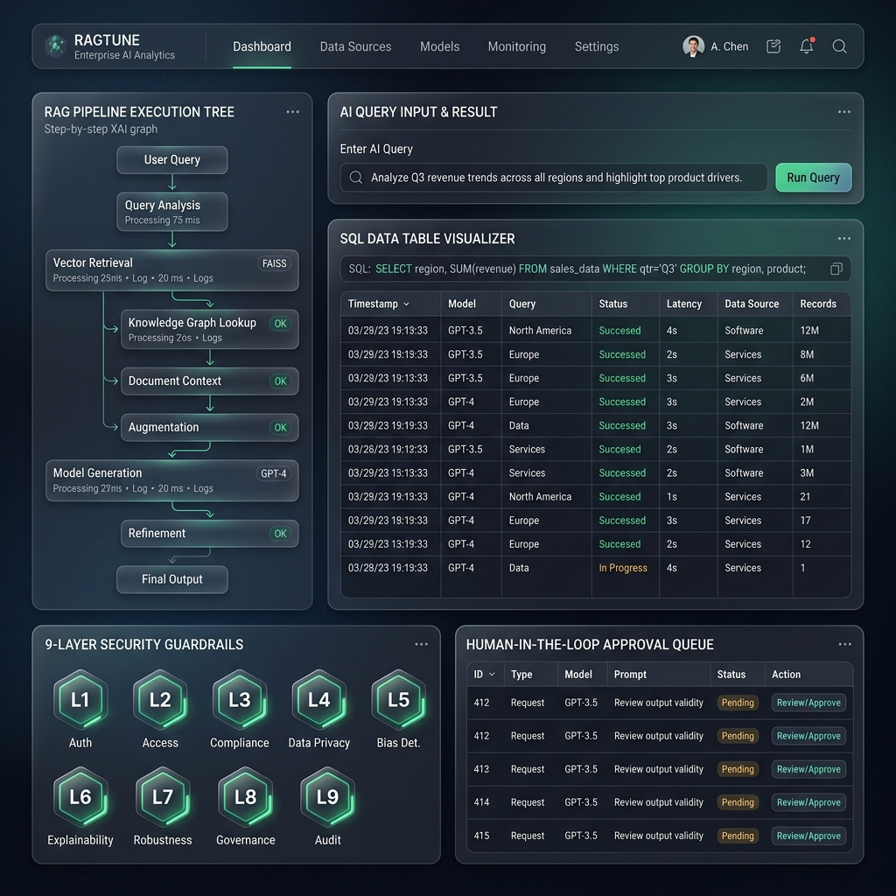
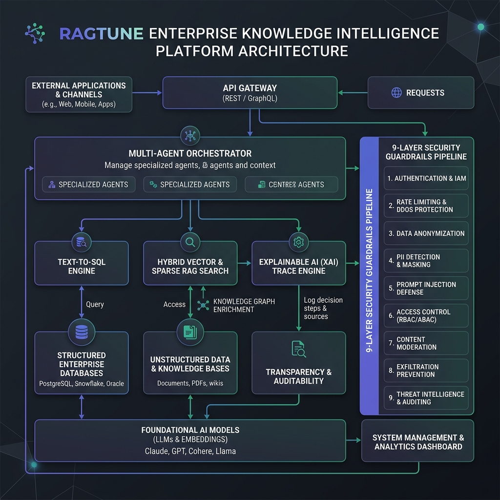
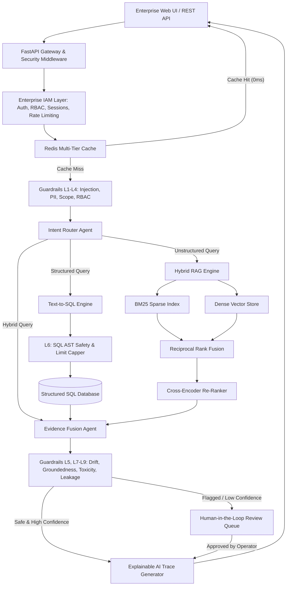

# RAGTUNE - Enterprise Knowledge Intelligence Platform


RAGTUNE is a domain-agnostic Enterprise Knowledge Intelligence Platform engineered for organizations to query, reason, and execute evidence-backed decisions across structured SQL databases and unstructured enterprise documents.

Unlike simple conversational chatbots, RAGTUNE is a deterministic, secure, and transparent intelligence platform combining multi-agent orchestration, Text-to-SQL synthesis, hybrid retrieval, a 9-layer security guardrails pipeline, Explainable AI (XAI) execution tracing, and Human-in-the-Loop (HITL) approval workflows.



---

## Table of Contents
- [Platform Architecture](#platform-architecture)
- [Enterprise IAM & Multi-Tenancy](#enterprise-iam--multi-tenancy)
- [9-Layer Enterprise Guardrails Pipeline](#9-layer-enterprise-guardrails-pipeline)
- [Core Technology Stack](#core-technology-stack)
- [Quick Start Guide](#quick-start-guide)
- [REST API Documentation](#rest-api-documentation)
- [License](#license)

---

## Platform Architecture

RAGTUNE is built around an event-driven multi-agent state machine powered by LangGraph. All incoming user requests are processed through pre-execution guardrails, classified by an Intent Router Agent, routed to domain execution agents, synthesized into evidence-backed narratives, and validated through post-execution security guardrails before final trace generation.





---

## Enterprise IAM & Multi-Tenancy

The platform provides a completely decoupled Identity and Access Management (IAM) trust boundary operating independently from AI reasoning services:

- **Multi-Tenant Hierarchy**: Strict isolation across Organization, Workspace, Project, and User entities.
- **Cryptographic Security**: PBKDF2-HMAC-SHA256 password hashing (600,000 rounds) with random salts and SHA-256 token digest storage.
- **Refresh Token Rotation (RTR)**: Every token refresh invalidates the prior refresh token and issues a new pair. Token reuse attempts automatically revoke all active sessions for the user across all devices.
- **Instant Security Revocation**: Password changes or administrative account suspensions instantly revoke active sessions.
- **Role-Based Access Control (RBAC)**: Fine-grained permission matrices checking Organization Roles (OWNER, ADMIN, MEMBER, GUEST) and Workspace Roles (WORKSPACE_ADMIN, MEMBER, VIEWER).
- **Brute-Force & Rate Limiting**: Exponential backoff and account lockouts after 5 consecutive login failures.
- **Security Audit Logging**: Immutable tracking of authentication attempts, privilege escalations, password modifications, and administrative suspensions.

---

## 9-Layer Enterprise Guardrails Pipeline

RAGTUNE enforces a 9-layer security boundary evaluated across pre-execution and post-execution phases:

| Layer | Guardrail Name | Scope | Technical Description |
| :--- | :--- | :--- | :--- |
| **L1** | **Prompt Injection Defense** | Pre-Execution | Scans incoming queries for jailbreak patterns, system instruction overrides, and adversarial prompt payloads. |
| **L2** | **PII & PHI Anonymization** | Pre-Execution | Identifies and dynamically masks Emails, Phone Numbers, SSNs, Credit Cards, and IP Addresses. |
| **L3** | **Domain Scope Boundary** | Pre-Execution | Validates that queries align with enterprise business domains and rejects off-topic requests. |
| **L4** | **RBAC & Tenant Isolation** | Pre-Execution | Verifies caller permissions and restricts multi-tenant database table access. |
| **L5** | **Semantic Drift Guard** | Post-Execution | Measures context-query embedding overlap to detect and prevent semantic hallucination drift. |
| **L6** | **SQL AST Safety & Limit Capper** | Pre/Post Execution | AST parsing via `sqlglot` to strictly enforce read-only SELECT statements and cap query result limits. |
| **L7** | **Groundedness & NLI Citation** | Post-Execution | Evaluates sentence-by-sentence factual grounding against source evidence. |
| **L8** | **Toxicity & Harm Filter** | Post-Execution | Scans output content for profane, harmful, toxic, or discriminatory terminology. |
| **L9** | **Data Leakage Scanner** | Post-Execution | Prevents leakage of internal credentials, API keys, passwords, or system prompt instructions. |

---

## Core Technology Stack

- **Backend Gateway**: FastAPI, Pydantic v2, Uvicorn
- **Database Persistence**: SQLAlchemy 2.0, SQLite / PostgreSQL
- **Orchestration**: LangGraph State Graph Framework
- **Retrieval Engine**: BM25 Sparse Index + Cosine Similarity Vector Store with Reciprocal Rank Fusion (RRF)
- **Re-Ranking**: Feature-based Cross-Encoder Re-Ranker
- **SQL Parser**: SQLGlot AST Engine
- **Caching**: Multi-Tier Redis & In-Memory Caching
- **Frontend Dashboard**: HTML5, Vanilla CSS Glassmorphism, Modern SPA Architecture

---

## Quick Start Guide

### 1. Installation
Clone the repository and install the dependencies:

```bash
git clone https://github.com/sreeram0343/ragtune.git
cd ragtune
pip install -r requirements.txt
```

### 2. Seed Enterprise Demo Data
Generate the pre-seeded SQLite enterprise database and sample knowledge documents:

```bash
python main.py --seed
```

### 3. Launch Web Platform & Gateway Server
Start the platform on `http://localhost:8000`:

```bash
python main.py
```

Access the interactive Web Dashboard in your browser: `http://localhost:8000`

### 4. Run Standalone CLI Query
Execute an intelligence query via the command line interface:

```bash
python main.py --query "What is our uptime commitment for Acme Enterprise under SLA terms?"
```

### 5. Run Automated Test Suite
Execute the full test suite covering IAM, authentication, token rotation, RBAC, guardrails, Text-to-SQL, hybrid search, agents, and REST APIs:

```bash
python -m pytest tests/ -v
```

---

## REST API Documentation

### Authentication & IAM Endpoints
- `POST /api/v1/auth/register`: User registration with password strength validation.
- `POST /api/v1/auth/login`: Authenticates credentials and issues Access + Refresh Tokens.
- `POST /api/v1/auth/refresh`: Refresh Token Rotation (RTR).
- `POST /api/v1/auth/logout`: Revokes current active session.
- `POST /api/v1/auth/logout-all`: Revokes all user sessions across all devices.
- `GET /api/v1/auth/me`: Returns user profile and active SecurityContext permissions.
- `POST /api/v1/auth/password/change`: Password update with session revocation.
- `POST /api/v1/auth/organizations`: Creates Organization and default Workspace.
- `POST /api/v1/auth/invitations`: Issues secure invitation token.
- `POST /api/v1/auth/invitations/accept`: Accepts invitation token.
- `GET /api/v1/auth/audit-logs`: Queries immutable security audit log history.
- `POST /api/v1/auth/admin/users/{user_id}/suspend`: Administrative account suspension.

### Query Intelligence Endpoints
- `POST /api/v1/query`: Submits query to multi-agent reasoning engine.
- `POST /api/v1/ingest/text`: Ingests document snippets into hybrid vector retriever.
- `GET /api/v1/schema`: Returns introspected database tables and column schemas.
- `GET /api/v1/hitl/queue`: Lists pending Human-in-the-Loop review tickets.
- `POST /api/v1/hitl/action`: Approves or rejects pending HITL tickets.
- `GET /api/v1/xai/{trace_id}`: Retrieves step-by-step XAI execution graph.
- `GET /api/v1/cache/stats`: Returns cache performance telemetry.

---

## License

Released under the MIT License. Built for enterprise knowledge intelligence.
