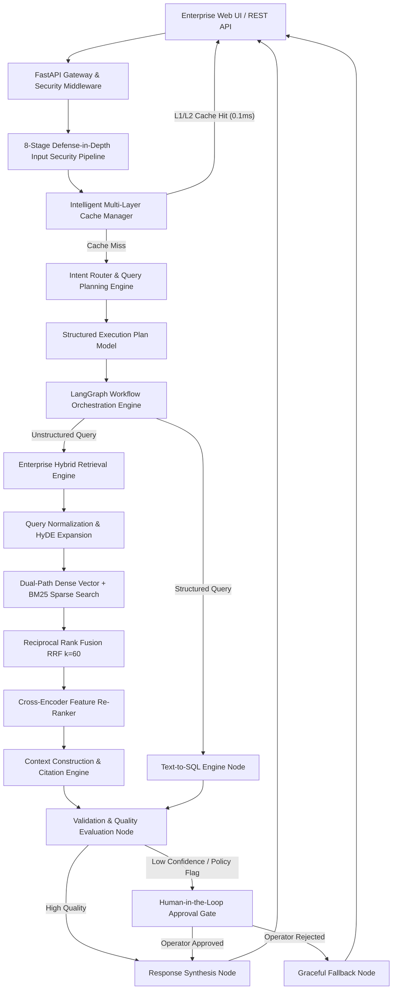
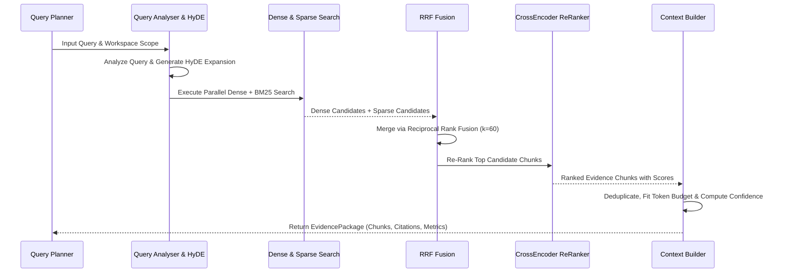

# RAGTUNE - Enterprise Knowledge Intelligence Platform


RAGTUNE is a domain-agnostic Enterprise Knowledge Intelligence Platform engineered for organizations to query, reason, and execute evidence-backed decisions across structured SQL databases and unstructured enterprise documents.

Unlike simple conversational chatbots, RAGTUNE is a deterministic, secure, and transparent intelligence platform combining a Production-Grade Hybrid Retrieval Engine, an Intent Router, multi-agent orchestration, Text-to-SQL synthesis, an 8-stage Input Security Pipeline, an Intelligent Multi-Layer Caching System, a 9-layer Guardrails system, Explainable AI (XAI) execution tracing, and Human-in-the-Loop (HITL) approval workflows.


---

## Table of Contents
- [Platform Architecture](#platform-architecture)
- [Enterprise Hybrid Retrieval Engine](#enterprise-hybrid-retrieval-engine)
- [Intent Router & Query Planning Engine](#intent-router--query-planning-engine)
- [Workflow Orchestration Engine](#workflow-orchestration-engine)
- [Intelligent Caching System](#intelligent-caching-system)
- [Input Security Pipeline](#input-security-pipeline)
- [Enterprise IAM & Multi-Tenancy](#enterprise-iam--multi-tenancy)
- [9-Layer Enterprise Guardrails Pipeline](#9-layer-enterprise-guardrails-pipeline)
- [Core Technology Stack](#core-technology-stack)
- [Quick Start Guide](#quick-start-guide)
- [REST API Documentation](#rest-api-documentation)
- [License](#license)

---

## Platform Architecture

RAGTUNE is built around an event-driven multi-agent state machine powered by LangGraph. All incoming user requests pass through a centralized Input Security Pipeline, an Intelligent Multi-Layer Cache, an Intent Router, and an Enterprise Hybrid Retrieval Engine.




---

## Enterprise Hybrid Retrieval Engine

The Enterprise Hybrid Retrieval Engine (`retrieval/`) discovers, ranks, re-ranks, and packages grounded evidence chunks from enterprise documents while enforcing multi-tenant row-level security isolation.



### Core Retrieval Subsystems:
1. **Domain & Evidence Models (`retrieval/domain.py`)**: `DocumentChunk`, `SearchCandidate`, `CitationReference`, `RetrievalMetrics`, and `EvidencePackage`.
2. **Query Understanding & HyDE Expander (`retrieval/query_analysis.py`)**: Normalization, keyword extraction, and selective Hypothetical Document Expansion (HyDE) for complex queries.
3. **Dual-Path Hybrid Search (`retrieval/search.py`)**: Dense Vector Similarity Search combined with BM25 Lexical Keyword Search under strict multi-tenant workspace isolation.
4. **Reciprocal Rank Fusion (`retrieval/fusion.py`)**: Merges dense and sparse candidate rankings using $RRF\_Score(d) = \sum \frac{1}{k + r(d)}$ with $k=60$.
5. **Cross-Encoder Re-Ranker (`retrieval/rerank.py`)**: Cross-Encoder feature re-ranker scoring query-chunk candidate pairs.
6. **Intelligent Context Construction (`retrieval/context.py`)**: Assembles citation-preserved context windows, enforces token budgets (e.g. max 1,500 tokens), deduplicates text snippets, and computes retrieval confidence.
7. **IR Evaluation Subsystem (`retrieval/eval.py`)**: Calculates Precision@K, Recall@K, MRR (Mean Reciprocal Rank), and nDCG metrics.

---

## Intent Router & Query Planning Engine

The Intent Router and Query Planning Engine (`router/`) acts as the decision-making brain of the platform. Rather than executing query tools directly, it analyzes user intent, discovers available platform capabilities, evaluates cost and latency trade-offs, and outputs a structured **Execution Plan** (`ExecutionPlan`).

---

## Workflow Orchestration Engine

The orchestration engine (`orchestration/`) serves as the central nervous system of the platform. Built using **LangGraph**, it manages workflow lifecycles, node execution, state checkpointing, fault recovery, and Human-in-the-Loop (HITL) approval gates.

---

## Intelligent Caching System

The platform features an intelligent, multi-layer caching architecture (`cache/`) positioned immediately after request validation:

- **Multi-Tenant Key Isolation (`TenantCacheKeyBuilder`)**: Generates SHA-256 keys in format `ragtune:{tenant_id}:{workspace_id}:{namespace}:{hash}`.
- **L1 Exact Match Hash Cache (`InMemoryLRUCacheProvider` / `RedisCacheProvider`)**: Microsecond lookup ($< 0.1\text{ms}$) with thread-safe LRU eviction and sliding/absolute TTL.
- **L2 Semantic Vector Cache (`SemanticCacheEngine`)**: Cosine similarity matching ($\ge 0.92$ threshold) enabling response reuse for semantically equivalent queries.
- **Single-Flight Coalescing (`SingleFlightLock`)**: Prevents cache stampedes by executing duplicate concurrent cache misses exactly once.
- **Tag-Based Invalidation (`CacheInvalidationEngine`)**: Event-driven cache purging listening for system events (`document:updated`, `schema:changed`, `user:permissions_changed`, `workspace:deleted`).

---

## Input Security Pipeline

All inbound requests enter the system through a centralized 8-stage Defense-in-Depth pipeline (`input_security/`):

| Stage | Security Stage Name | Technical Scope & Responsibilities |
| :--- | :--- | :--- |
| **Stage 1** | **Payload & Schema Validation** | Enforces 2MB maximum payload size limits, validates JSON syntax, and blocks path traversal attempts (`../`). |
| **Stage 2** | **Authentication & Session Verification** | Validates Bearer access tokens, verifies signature claims, checks DB session revocation, and enforces account active status. |
| **Stage 3** | **Multi-Tenant RBAC Authorization** | Evaluates Organization and Workspace roles against target endpoint permissions to enforce tenant isolation. |
| **Stage 4** | **Rate Limiting & Token Budgeting** | Tracks request velocity (max 60 req/min) and caps input token counts (max 4,000 tokens) to prevent Denial-of-Wallet attacks. |
| **Stage 5** | **Request Normalization & Sanitization** | Applies NFKC Unicode normalization, strips zero-width space bypasses, and sanitizes XSS script tags. |
| **Stage 6** | **Prompt Inspection & Jailbreak Defense** | Inspects query text for direct/indirect prompt injection, adversarial roleplay (DAN), and system instruction overrides. |
| **Stage 7** | **PII & PHI Detection & Anonymization** | Detects and dynamically redacts Emails, Phone Numbers, SSNs, Credit Cards, and IP Addresses. |
| **Stage 8** | **Risk Scoring & Context Enrichment** | Calculates cumulative threat risk score (0-100), assigns Trust Level (HIGH, MEDIUM, LOW, UNTRUSTED), and enriches request context. |

---

## Enterprise IAM & Multi-Tenancy

The platform identity architecture provides a production-ready trust boundary:

- **Multi-Tenant Hierarchy**: Strict isolation across Organization, Workspace, Project, and User entities.
- **Cryptographic Security**: PBKDF2-HMAC-SHA256 password hashing (600,000 rounds) with random salts and SHA-256 token digest storage.
- **Refresh Token Rotation (RTR)**: Every token refresh invalidates the prior refresh token and issues a new pair.
- **Instant Security Revocation**: Password changes or administrative account suspensions instantly revoke active sessions.
- **Role-Based Access Control (RBAC)**: Fine-grained permission matrices checking Organization Roles and Workspace Roles.

---

## 9-Layer Enterprise Guardrails Pipeline

RAGTUNE enforces a 9-layer security boundary evaluated across pre-execution and post-execution phases:

| Layer | Guardrail Name | Scope | Technical Description |
| :--- | :--- | :--- | :--- |
| **L1** | **Prompt Injection Defense** | Pre-Execution | Scans incoming queries for jailbreak patterns and adversarial prompt payloads. |
| **L2** | **PII & PHI Anonymization** | Pre-Execution | Identifies and dynamically masks Emails, Phone Numbers, SSNs, Credit Cards, and IP Addresses. |
| **L3** | **Domain Scope Boundary** | Pre-Execution | Validates that queries align with enterprise business domains and rejects off-topic requests. |
| **L4** | **RBAC & Tenant Isolation** | Pre-Execution | Verifies caller permissions and restricts multi-tenant database table access. |
| **L5** | **Semantic Drift Guard** | Post-Execution | Measures context-query embedding overlap to detect and prevent semantic hallucination drift. |
| **L6** | **SQL AST Safety & Limit Capper** | Pre/Post Execution | AST parsing via `sqlglot` to strictly enforce read-only SELECT statements and cap query result limits. |
| **L7** | **Groundedness & NLI Citation** | Post-Execution | Evaluates sentence-by-sentence factual grounding against source evidence. |
| **L8** | **Toxicity & Harm Filter** | Post-Execution | Scans output content for profane, harmful, toxic, or discriminatory terminology. |
| **L9** | **Data Leakage Scanner** | Post-Execution | Prevents leakage of internal credentials, API keys, passwords, or system prompt instructions. |

---

## Core Technology Stack

- **Backend Gateway**: FastAPI, Pydantic v2, Uvicorn
- **Hybrid Retrieval Engine**: Dense Vector Search, BM25 Lexical Sparse Search, RRF Fusion ($k=60$), Cross-Encoder Re-Ranker
- **Intent Router & Planner**: Dynamic Capability Registry, Pattern Intent Classifier, Strategy Decision Engine
- **Orchestration Engine**: LangGraph StateGraph Framework, State Checkpointer
- **Intelligent Caching System**: L1 Exact Match LRU Cache, L2 Cosine Semantic Vector Cache, Single-Flight Coalescing Lock
- **Input Security Pipeline**: 8-Stage Defense-in-Depth Framework, Unicode NFKC, Regex Threat Classifiers
- **Database Persistence**: SQLAlchemy 2.0, SQLite / PostgreSQL
- **SQL Parser**: SQLGlot AST Engine
- **Frontend Dashboard**: HTML5, Vanilla CSS Glassmorphism, Modern SPA Architecture

---

## Quick Start Guide

### 1. Installation
Clone the repository and install the dependencies:

```bash
git clone https://github.com/sreeram0343/ragtune.git
cd ragtune
pip install -r requirements.txt
```

### 2. Seed Enterprise Demo Data
Generate the pre-seeded SQLite enterprise database and sample knowledge documents:

```bash
python main.py --seed
```

### 3. Launch Web Platform & Gateway Server
Start the platform on `http://localhost:8000`:

```bash
python main.py
```

Access the interactive Web Dashboard in your browser: `http://localhost:8000`

### 4. Run Standalone CLI Query
Execute an intelligence query via the command line interface:

```bash
python main.py --query "What is our uptime commitment for Acme Enterprise under SLA terms?"
```

### 5. Run Automated Test Suite
Execute the full test suite covering Hybrid Retrieval, Intent Router & Planning, LangGraph Workflow Orchestration, Intelligent Cache, Input Security Pipeline, IAM, authentication, token rotation, RBAC, guardrails, Text-to-SQL, agents, and REST APIs:

```bash
python -m pytest tests/ -v
```

---

## REST API Documentation

### Authentication & IAM Endpoints
- `POST /api/v1/auth/register`: User registration with password strength validation.
- `POST /api/v1/auth/login`: Authenticates credentials and issues Access + Refresh Tokens.
- `POST /api/v1/auth/refresh`: Refresh Token Rotation (RTR).
- `POST /api/v1/auth/logout`: Revokes active session.
- `POST /api/v1/auth/logout-all`: Revokes all user sessions across all devices.
- `GET /api/v1/auth/me`: Returns user profile and active SecurityContext permissions.
- `POST /api/v1/auth/password/change`: Password update with session revocation.
- `POST /api/v1/auth/organizations`: Creates Organization and default Workspace.
- `POST /api/v1/auth/invitations`: Issues secure invitation token.
- `POST /api/v1/auth/invitations/accept`: Accepts invitation token.
- `GET /api/v1/auth/audit-logs`: Queries immutable security audit log history.
- `POST /api/v1/auth/admin/users/{user_id}/suspend`: Administrative account suspension.

### Query Intelligence Endpoints
- `POST /api/v1/query`: Submits query to multi-agent reasoning engine.
- `POST /api/v1/ingest/text`: Ingests document snippets into hybrid vector retriever.
- `GET /api/v1/schema`: Returns introspected database tables and column schemas.
- `GET /api/v1/hitl/queue`: Lists pending Human-in-the-Loop review tickets.
- `POST /api/v1/hitl/action`: Approves or rejects pending HITL tickets.
- `GET /api/v1/xai/{trace_id}`: Retrieves step-by-step XAI execution graph.
- `GET /api/v1/cache/stats`: Returns cache performance telemetry.

---

## License

Released under the MIT License. Built for enterprise knowledge intelligence.
